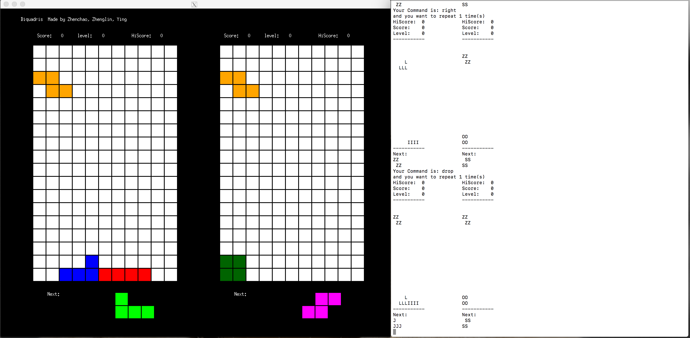
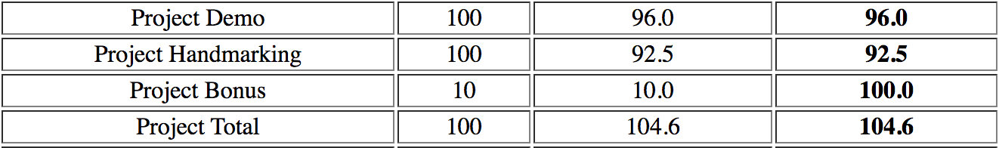

# Biquadris
A modified version of Tetris, which allows two players to play a turn-based Tetris game with several features. If you need to see the source code, feel free to contact me.

Screenshot of the graphic and text display of this game:

The final project received grade of 104.6/100.

